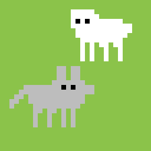
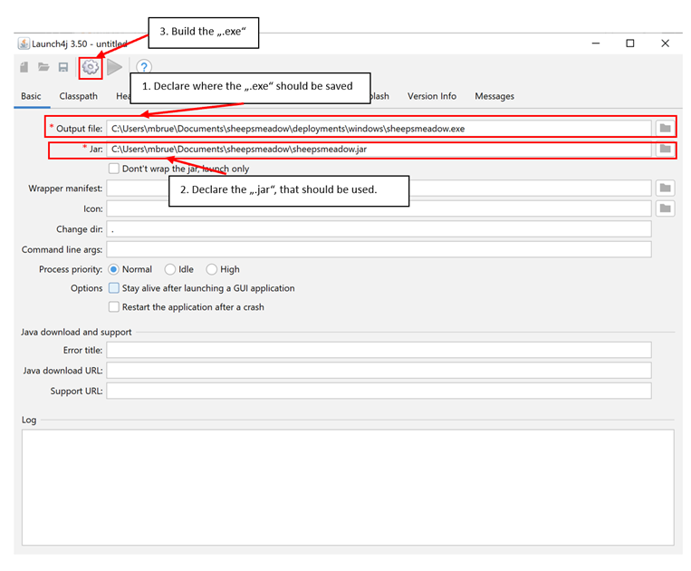

 

# Sheepsmeadow
**Sheepsmeadow** is a simulation program designed and distributed with the [MASON Framework](https://cs.gmu.edu/~eclab/projects/mason/). It fascilliates options to create a number of Sheeps and Wolves on a Meadow and observe their interaction over time. 

Purpose of this simulation is to give an introduction to "Multi-Agent-Systems" (MAS) for undergrad Students making their first steps in MAS. They can tweak the model parameters and observe the changes of the simulation state in each time steps via a GUI. Also some simple "live statistics" will be provided.

# How to start 'Sheepsmeadow'?

## Prerequisites
- you need to install `make` on your machine 
    - **Windows**: Download [make](https://gnuwin32.sourceforge.net/downlinks/make.php). Then start the ".exe". This will install `make` on your machine. After installation, add `make` to your `PATH`-Variables.
    - **Linux**: Install via your favorite package manager
- you need at least Java 21 or newer. Visit the [Java Website](https://www.oracle.com/java/technologies/downloads/) to download the JDK.
- you need to "clone" this Repository
```bash
git clone https://github.com/MichaelBrueggemann/sheepsmeadow.git
```

### Terminal based
1. Change to this projects root directory `sheepsmeadow/`
2. Enter `make run` in the console
    - this will open the GUI to start a simulation

### Executable based
- **Windows**:
    1. Unzip `.zip` in `deployments/windows/`
    2. Double-click the ".exe"
- **Linux-Debian**: 
    1. [Deploy](#deploy-linux-debian) 'Sheepsmeadow' for Linux-Debian
    2. Install 'Sheepsmeadow' for Linux-Debian
    3. Add `Sheepsmeadow` to `$PATH`
    ```
    export PATH=/opt/sheepsmeadow/bin:$PATH
    ``` 
    4. Run: 
    ```bash
    Sheepsmeadow
    ```

## Run tests
Tests for this project are defined in `./tests`. Each testfile is automaticly compiled and run on every "push" of this repositoy as part of the Testing Pipeline (see [GitHub Workflow](./.github/workflows/tests.yaml)).

To run a test locally, execute: 
```Bash
make test
```

# Deploy Sheepsmeadow
To deploy **Sheepsmeadow** on different systems, please follow these steps:

### Prerequisites
- **Windows**: You need to install `Launch4j` **Version 3.50** or higher. You can download it here: [Launch4j](https://sourceforge.net/projects/launch4j/files/launch4j-3/3.50/)
- **Linux-Debian**: No Prerequisites to deploy

## Deploy Windows
1. Open `Launch4J`
2. Create `.exe`  
    - **Output file**: `path/to/sheepsmeadow/executables/windows`
    - **Jar**: `path/to/sheepsmeadow/deployments/jar/sheepsmeadow.jar`

You don't need to provide any further information.

##  Deploy Linux-Debian
1. Create a `.jar` file of **Sheepsmeadow** (only the name `sheepsmeadow.jar` is supported!)
```Bash
make sheepsmeadow.jar
```
Alternatively you can use the `.jar` provided in `deployments/jar`

2. Run `make deploy-linux-deb`. This will create a `.deb` file in `deployments/linux-deb` named `sheepsmeadow_1.0_amd64.deb`
```bash
make deploy-linux-deb
```
3. Install the `.deb` file. You can use `make install-linux-deb`. This creates a tempory directory in `/tmp/sheepsmeadow` and installs the application using `apt`. The `.deb` file **must** be stored like this: `/tmp/sheepsmeadow/sheepsmeadow_1.0_amd64.deb`!!
You will need to enter your `sudo` password
```bash
make install-linux-deb
```
The binary will be stored in `/opt/sheepsmeadow/bin/`.

# Reflections on this project
In this Section I will note some of my experiences with this project. Those notes aren't necessary to use this simulation tool, so feel free to skip the reading:


## 08.03.2024

- MASON extensively used the MVC paradigm (Model-View-Controller):
    - a **Model** is defined e.g. as a `SimState` instance.
    - a **View** is a specific Visualization (2D, 3D, etc.).
    - a **Controller** is a GUI, TUI, CLI to interact with the Model.

    > In this regard, all project files are also organised in the MVC pattern.
    - this was a great opportunity for me to refresh my college knowledge of the MVC pattern.

## 12.03.2024
- I implemented a automated testing pipeline for the following reasons:
    1. keeping myself accountable. Any push will be checked by the pipeline, so I have to design my code in compliance with my tests or my build will fail (and I get annoying emails because of that).
    2. Learn to set up testing enviroments. Setting up this pipeline was a new experience for me, as these tests arent run on my local machine, but instead are run in a VM on GitHub. Therefore debugging was a bit challenging (I encountered the famous "but it works on my machine" a lot :) ). Using the tool `act` was a great help, to debug the VM locally.

## 11.04.2024
- In the current implementation, each agent will get a new `Int2D`-Object every time a location has to be changed. This is incredibly inefficient, as this pollutes memory. I decided to leave it in, as the effort needed to change this doesn't outweigh the benefit, as this project doesn't aim to provide the most performant simulation, but instead provide a simple example to learn Agent-Based-Modelling. This programm should be used as explanatory material in an first year undergrad course, so I think this is a fair consideration, as this is only a hobby project of me.

## 26.04.2024
- changed the implementation of a Neighbourhood, to enable an easier control flow to evaluate if an `Action` can be performed on an `Agent`.

- Actions (rules) an agent can perform should be encapsulated in an object. This has the benefit, that the use of the `Action` interface can be enforced. This allows me to use the `checkCondition()` and `execute()` function in the agents source code. This later enables other Users to add new `Action`s, will still securing that the model logic won't break.

- Each `Action` has a condition (defined by the `checkCondition()` function) that defines when the `Action` can be applied. 

- All Actions of an `Agent` are collected in a `ruleSet`, a PriorityQuene\<Action>  which sorts all `Action`s of an `Agent` by their `priority`. This defines the "importance" of "Action"s for the "Agent".

## 28.04.2024
Funny Note: on 08.03.2024 when setting up this project, I decided to represent each cell of the models grid as stacks of entities (Stack\<Entity>) as I thought that this would be a clever way to have multiple Entities in one grid cell whilst also having an easy way to decide, if a cell is already occupied (stack size is greater than 1). 
Today seems to be the day this bites me in the ass, as I figured out that MASONs `LabeledPortrayal2D` is defined on Object directly passed from another object (my grid). But this grid doesnt pass the actual Entity-objects as `LabeledPortrayal2D` would expect, but passes `Stack<Entity>` objects instead. Running the model then greets me with this kind error message:

```
Exception in thread "AWT-EventQueue-0" java.lang.ClassCastException: class Model.Entities.Objects.Grass cannot be cast to class java.util.Stack (Model.Entities.Objects.Grass is in unnamed module of loader 'app'; java.util.Stack is in module java.base of loader 'bootstrap')
        at View.MeadowDisplay$1.draw(MeadowDisplay.java:42)
        at sim.portrayal.simple.LabelledPortrayal2D.draw(LabelledPortrayal2D.java:182)
        at View.MeadowDisplay$2.draw(MeadowDisplay.java:63)
        at sim.portrayal.grid.ObjectGridPortrayal2D.hitOrDraw(ObjectGridPortrayal2D.java:220)
        at sim.portrayal.FieldPortrayal2D.draw(FieldPortrayal2D.java:84)
        at sim.display.Display2D$InnerDisplay2D.paintUnbuffered(Display2D.java:671)
        at sim.display.Display2D$InnerDisplay2D.paint(Display2D.java:594)
        at sim.display.Display2D$InnerDisplay2D.paintComponent(Display2D.java:524)
        at sim.display.Display2D$InnerDisplay2D.paintComponent(Display2D.java:511)
        at java.desktop/javax.swing.JComponent.paint(JComponent.java:1128)
        at java.desktop/javax.swing.JComponent.paintChildren(JComponent.java:961)
        at java.desktop/javax.swing.JComponent.paint(JComponent.java:1137)
        at java.desktop/javax.swing.JViewport.paint(JViewport.java:736)
        at java.desktop/javax.swing.JComponent.paintChildren(JComponent.java:961)
        at java.desktop/javax.swing.JComponent.paint(JComponent.java:1137)
        at java.desktop/javax.swing.JComponent.paintChildren(JComponent.java:961)
        at java.desktop/javax.swing.JComponent.paint(JComponent.java:1137)
        at java.desktop/javax.swing.JComponent.paintChildren(JComponent.java:961)
        at java.desktop/javax.swing.JComponent.paint(JComponent.java:1137)
        at java.desktop/javax.swing.JComponent.paintToOffscreen(JComponent.java:5318)
        at java.desktop/javax.swing.BufferStrategyPaintManager.paint(BufferStrategyPaintManager.java:246)
        at java.desktop/javax.swing.RepaintManager.paint(RepaintManager.java:1336)
        at java.desktop/javax.swing.JComponent._paintImmediately(JComponent.java:5266)
        at java.desktop/javax.swing.JComponent.paintImmediately(JComponent.java:5076)
        at java.desktop/javax.swing.RepaintManager$4.run(RepaintManager.java:878)
        at java.desktop/javax.swing.RepaintManager$4.run(RepaintManager.java:861)
        at java.base/java.security.AccessController.doPrivileged(AccessController.java:400)
        at java.base/java.security.ProtectionDomain$JavaSecurityAccessImpl.doIntersectionPrivilege(ProtectionDomain.java:87)
        at java.desktop/javax.swing.RepaintManager.paintDirtyRegions(RepaintManager.java:861)
        at java.desktop/javax.swing.RepaintManager.paintDirtyRegions(RepaintManager.java:834)
        at java.desktop/javax.swing.RepaintManager.prePaintDirtyRegions(RepaintManager.java:784)
        at java.desktop/javax.swing.RepaintManager$ProcessingRunnable.run(RepaintManager.java:1897)
        at java.desktop/java.awt.event.InvocationEvent.dispatch(InvocationEvent.java:318)
        at java.desktop/java.awt.EventQueue.dispatchEventImpl(EventQueue.java:773)
        at java.desktop/java.awt.EventQueue$4.run(EventQueue.java:720)
        at java.desktop/java.awt.EventQueue$4.run(EventQueue.java:714)
        at java.base/java.security.AccessController.doPrivileged(AccessController.java:400)
        at java.base/java.security.ProtectionDomain$JavaSecurityAccessImpl.doIntersectionPrivilege(ProtectionDomain.java:87)
        at java.desktop/java.awt.EventQueue.dispatchEvent(EventQueue.java:742)
        at java.desktop/java.awt.EventDispatchThread.pumpOneEventForFilters(EventDispatchThread.java:203)
        at java.desktop/java.awt.EventDispatchThread.pumpEventsForFilter(EventDispatchThread.java:124)
        at java.desktop/java.awt.EventDispatchThread.pumpEventsForHierarchy(EventDispatchThread.java:113)
        at java.desktop/java.awt.EventDispatchThread.pumpEvents(EventDispatchThread.java:109)
        at java.desktop/java.awt.EventDispatchThread.pumpEvents(EventDispatchThread.java:101)
        at java.desktop/java.awt.EventDispatchThread.run(EventDispatchThread.java:90)
```

... I think it's time to implement Multi-Object grids as intended by MASON. 

- I changed the grid representation in the following way:
    - The grid now only contains one object per cell.
    - At model setup, the grid contains only `Grass` objects.
    - After calling `populateMeadow` the grid will contain `Agent` objects in each cell an agent was added to.
        - adding a new agent to a cell now stores the `Grass` object of the cell in the `Agent` object. When the `Agent` later updates it's location, the `Grass` object will be placed on the cell, the `Agent` has left.
    - the same will than happen in each Step of the model.


## 29.04.2024 - A note on Scheduling
- In the lecture example, each agents step is evaluated whilst "freezing" every other agent in their position. This means that a new position of an agent (which was previously "stepped") is not known to the other agents.
In this simulation on the other hand, all agent have a finite order, so an agent that would be out-of-reach for another agent (because it isn't placed in an adjacent grid cell) could move into a grid cell adjacent to another agent. This agent then checks it's "new" neighbourhood.
- This has to be kept in mind, when students try performing simulations with "Sheepsmeadow".

## 09.06.2024
- I added a makefile-script to automatically compile, run, build and deploy the application. This makes the development process a lot easier, as I can use the modular `make` commands to create the different artifacts
  - I also added placeholders inside of the makefile to make editing this file easier for the future
- The idea behind creating "deployments" for this application is, that I can deploy executables for different plattform, so that users can just download it and run it, without needing to compile everything from source. This makes this project much more accessible for others.
- to achieve deploying this app for "windows" I will use a virtual machine on my linux machine, so that I have the needed `jpackage` dependencies to create a `.exe` file. But this is still work in progress. 

## 11.08.2024
- Now  provided a way to compile and deploy 'Sheepsmeadow' also as an `.exe`-file. My Intention was, that also students with limited programming knowledge will use this simulation program, so it is crucial to provide an easy experience. This ensures that also those students can enjoy the beauty of this program, without having to build it from source.
- This also removes accessibilty barriers from this project, which makes this even more appealing.
- Compiling and Deploying this project on Linux-Debian was already possible

## 03.10.2024
- Today I provided images to use in this README and inside the application. I created those images using [pixelart](https://www.pixilart.com/draw). Here I really learned to appreciate AI art generation, as I created raster-based images which aren't fun to upscale. 
Fortunately, pixelart had an option to automatically upscale those images. This really boosted the design process and made my life significantly easier. 

## 15.10.2024
- Now it's also possible to deploy a ".dmg"

## 03.11.2024
- I improved the `makefile` so that it automatically detects, on which OS it was run. This enables easier compilation of the project across plattforms.